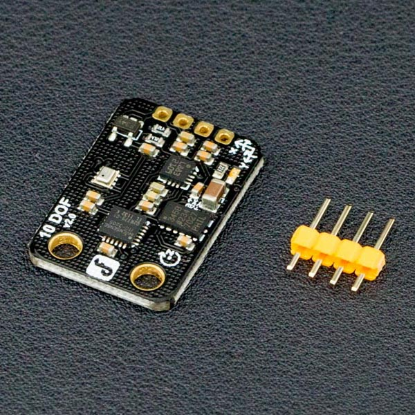

# DFRobot_FreeTenIMU

- [中文版](./README_CN.md)

DFrobot's highly integrated and low-cost 10-degree-of-freedom sensor incorporates the ADXL345 accelerometer, QMC5883L magnetic compass, ITG3205 gyroscope, and BMP280 pressure and temperature sensors.  Built-in low noise low voltage linear regulator, but also extended power supply voltage input range, support 3V-5V power supply voltage.  The 10-dOF IMU is also directly compatible with the Arduino board.  



## Product Link (https://www.dfrobot.com/product-818.html)

    SKU: SEN0140

## Table of Contents

* [Summary](#summary)
* [Installation](#installation)
* [Methods](#methods)
* [Compatibility](#compatibility)
* [History](#history)
* [Credits](#credits)

## Summary

This library provides an access to sensor values for speedometers, gyroscopes, magnetometers, and temperature and humidity sensors  

## Installation

To use this library, first download the library file, paste it into the \Arduino\libraries directory, then open the examples folder and run the demo in the folder.

## Methods

```C++

    /**
     * @fn begin
     * @brief Sensor initialization
     * @return  bool 
     * @retval  true Initialization succeeded
     * @retval  false Initialization failed
     */
    bool begin(void);

    /**
     * @fn getEul
     * @brief Get sensor elevation Angle, roll Angle, yaw Angle
     * @return sEulAnalog_t Save three angles
     */
    sEulAnalog_t  getEul(void);

```

## Compatibility

MCU                | Work Well    | Work Wrong   | Untested    | Remarks
------------------ | :----------: | :----------: | :---------: | -----
Arduino uno        |      √       |              |             | 
Mega2560        |      √       |              |             | 
Leonardo        |      √       |              |             | 
ESP32           |      √       |              |             | 
ESP8266           |      √       |              |             | 
micro:bit        |      √       |              |             | 

## History

- 2022/3/4 - Version 1.0.0 released.

## Credits

Written by Peng Kaixing(kaixing.peng@dfrobot.com), 2020. (Welcome to our [website](https://www.dfrobot.com/))